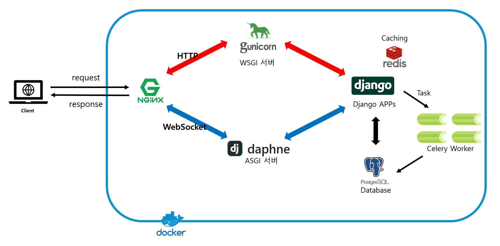
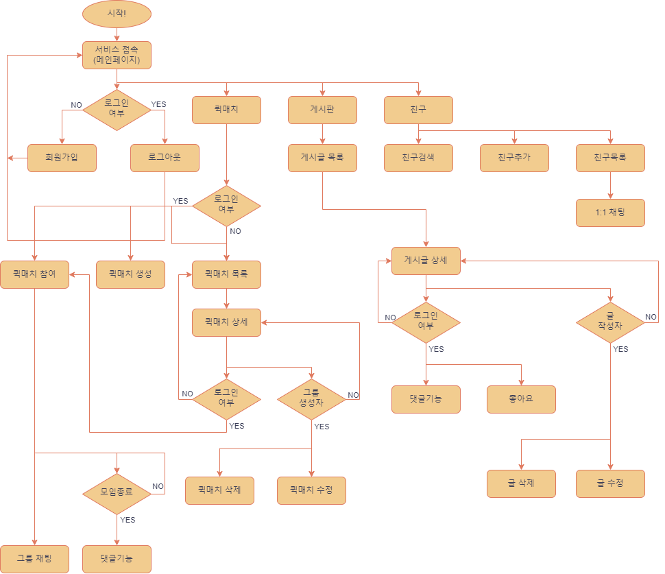
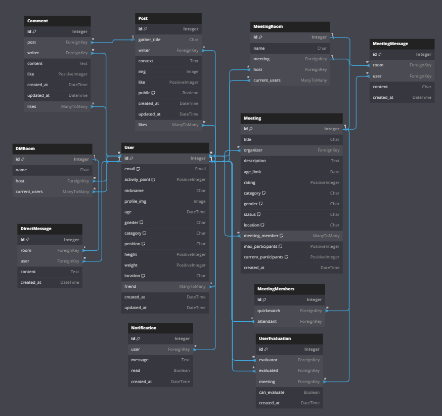

# XHub
단체 스포츠 모임 플랫폼 (Team sports gathering platform)

## 기여자
| 기여자 | 깃헙링크              |
|-------|---------------------|
| 김종완 | [Link](https://github.com/mireu-san) |
| 민성철 | [Link](https://github.com/AMinSC) |
| 유진수 | [Link](https://github.com/유진수) |


## 프로젝트 개요
- XHub는 단체운동을 하고 싶은 개인들이 모여 같이 운동을 즐길 수 있는 Hub역할의 서비스입니다.
- 좋아하지만 혼자서 즐기지 못하는 축구, 농구, 배드민턴 등의 운동들을 지역 주민들과 같이 즐길 수 있는 서비스입니다.
- 1회성 운동 모임을 하며, 마음이 잘 맞는 다른 사용자를 친구 추가하여 대화를 할 수도 있습니다.
- 1회성 운동 모임이 끝나면 사용자의 활동 점수에 영향이 가는 2중 선택지 평가를 하여, 매너 사용자와 비매너 사용자를 확인할 수도 있습니다.
- 1회성 운동 모임으로 운동도 즐길 수 있고, 게시판에서 운동에 관한 건강한 정보를 공유할 수도 있습니다.


## 프로젝트 구성도
- Web 서버로 NginX
- HTTP와 Websocket을 처리하는 서버를 gunicorn과 daphne로 따로 구성



## 프로젝트 흐름도



## 개발 환경
- Docker, Ubuntu 22.04, 2 vCPU, 2G(RAM)


## 프로젝트 실행 방법
```
- docker compose build
- docker compose up
(도커 실행 후, 추가 터미널 생성 해서 다음의 명령어를 실행합니다.)
- docker compose run django python manage.py collectstatic
- docker compose run django python manage.py makemigrations
- docker compose run django python manage.py migrate
- docker compose run django python manage.py runserver
```

## 개발기간
- 2023-08-18 ~ 2023-09-01


## 폴더트리
- core, player, quickmatch, board 앱으로 구성되어있고, 프로젝트 앱은 core 입니다.
- player와 quickmatch에는 실시간 채팅 기능을구현하기 위해 consumers.py 가 있습니다.
- channels_jwt_auth_middleware 폴더는 django 앱은 아니지만, 채팅 기능에서 jwt인증을 위해 필요한 미들웨어 입니다.

```
📦xhub_server
 ┣ 📂asset
 ┣ 📂board
 ┣ 📂channels_jwt_auth_middleware
 ┃ ┣ 📜auth.py
 ┃ ┗ 📜__init__.py
 ┣ 📂core
 ┃ ┣ 📜asgi.py
 ┃ ┣ 📜celery.py
 ┃ ┣ 📜settings.py
 ┃ ┣ 📜urls.py
 ┃ ┣ 📜wsgi.py
 ┃ ┗ 📜__init__.py
 ┣ 📂nginx
 ┃ ┗ 📜nginx.conf
 ┣ 📂player
 ┃ ┣ 📜...
 ┃ ┗ 📜consumers.py
 ┣ 📂quickmatch
 ┃ ┣ 📜...
 ┃ ┗ 📜consumers.py
 ┣ 📂staticfiles
 ┣ 📜.env
 ┣ 📜.flake8
 ┣ 📜.gitignore
 ┣ 📜docker-compose.yml
 ┣ 📜Dockerfile
 ┣ 📜manage.py
 ┣ 📜README.md
 ┣ 📜requirements.txt
 ┗ 📜__init__.py
```

## 개발환경
- Python 3.10+
- python-decouple 3.8
- Django 4.2+
- DRF  3.14.0
- DRF-simplejwt 5.2+
- swagger-ui-py 22.7+
- psycopg2 2.9+
<!--  MAC : install psycopg2-binary -->
그 외 requirements.txt 참고 부탁드립니다.

## 배포환경
- Amazon
    - Lightsail
- docker
  - 필요 부분들을 docker container로 만들고 docker compose를 이용해 한 번에 설치가 가능하도록 개발
  - 도커허브 이미지로 배포
- Nginx
- gunicorn

## Code Convention
### Code lay-out
- 줄 간격(indent)
    - class 별 2줄
    - class내 method 별 1줄

### Comments
- 주석(Docstring)을 작성할 때는 기존 코드에서 2칸을 띄고, # 에서 한칸 띄고 작성합니다.
    - `age = 30  # 주석`
### Naming Conventions
- 클래스 명은 파스칼케이스(PascalCase)로 작성합니다.
- 함수명과 변수명은 스네이크케이스(snake_case)로 작성합니다.

### Flake8, Black 적용
- .flake8


## 브랜치 전략
- 배포 브랜치: main
- 개발 브랜치: develop
    - 배포 전 기능 테스트 브랜치
- 기능 개발 브런치 : appname-function
    - ex) player-logout, quickmatch-create ...
    - 기능 개발 브랜치 완료 시 개발 브랜치(develop) 으로 merge


## ERD


기능 별 테이블 구분
- player
    - User (사용자-프로필)
    - DMRoom (1:1 채팅방)
    - DirectMessage (1:1 채팅)
- quickmatch
    - Meeting (1회성 모임)
    - MeetingMember (1회성 모임 멤버)
    - MeetingChat (1회성 모임 채팅)
    - UserEvaluation (유저 평가)
- board
    - Post (게시판)
    - Comment (댓글)


## URL

|   앱 이름  |        기능        |                          URL                         | Method |
|:----------:|:------------------:|:----------------------------------------------------:|:------:|
| player     | 회원가입           | 도메인/player/register/                              | POST   |
|            | 로그인             | 도메인/player/login/                                 | POST   |
|            | 로그아웃           | 도메인/player/logout/                                | POST   |
|            | 회원수정           | 도메인/player/update/                                | POST   |
|            | 회원탈퇴           | 도메인/player/unregister/                            | POST   |
|            | 전체 회원조회      | 도메인/player/search/                                | GET    |
|            | 친구 조회          | 도메인/player/friends/                               | GET    |
|            | 친구 추가          | 도메인/player/add_friend/                            | POST   |
|            | 친구 삭제          | 도메인/player/rm-friend/<int:friend_id>/             | POST   |
|            | 채팅 목록          | 도메인/player/chat-room/<int:room_id>/               | GET    |
|            | 채팅방 생성        | 도메인/player/chat-room/create/                      | POST   |
|            | 활동점수           | 도메인/player/                                       |        |
| quickmatch | 모임 만들기        | 도메인/quickmatch/create/                            | POST   |
|            | 모임 삭제          | 도메인/quickmatch/<int:quickmatchId>/delete/         | POST   |
|            | 모임 참가          | 도메인/quickmatch/join/<int:quickmatchId>/           | POST   |
|            | 모임 상태변경      | 도메인/quickmatch/<int:quickmatchId>/status/         | GET    |
|            | 모임 검색          | 도메인/quickmatch/search/                            | GET    |
|            | 회원평가           | 도메인/quickmatch/                                   |        |
|            | 모임만족도         | 도메인/quickmatch/                                   |        |
|            | 대화기능(그룹대화) | 도메인/quickmatch/                                   |        |
| board      | 게시글 조회(전체)  | 도메인/board/                                        | GET    |
|            | 게시글 생성        | 도메인/board/create/                                 | POST   |
|            | 게시글 상세보기    | 도메인/board/<int:board_id>/detail/                  | GET    |
|            | 게시글 삭제        | 도메인/board/<int:board_id>/delete/                  | POST   |
|            | 게시글 수정        | 도메인/board/<int:board_id>/update/                  | POST   |
|            | 게시글 좋아요      | 도메인/board/<int:board_id>/like/                    | POST   |
|            | 댓글 달기          | 도메인/board/<int:board_id>/comment/write/           | POST   |
|            | 댓글 삭제          | 도메인/board/<int:board_id>/<int:comment_id>/delete/ | POST   |
|            | 댓글 수정          | 도메인/board/<int:board_id>/<int:comment_id>/edit    | POST   |
|            | 댓글 좋아요        | 도메인/board/<int:board_id>/<int:comment_id>/like/   | POST   |
|            | 댓글 리스트(조회)  | 도메인/board/<int:board_id>/comments/                | GET    |

## 라이센스
- MIT License
- 본 프로젝트는 상업적 용도로 사용되지 않습니다.

## 한계점
- 비중은 백엔드 서버 기능 구현 부분에 초점을 두고 개발을 진행하였습니다.
- 개발 도중 인원에 변동이 생겨 기획했던 부분에 대해 전체 계획을 수정하는 부분에서 미흡했습니다.
